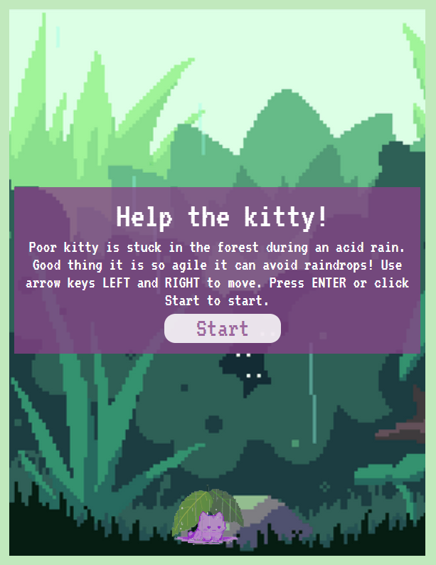
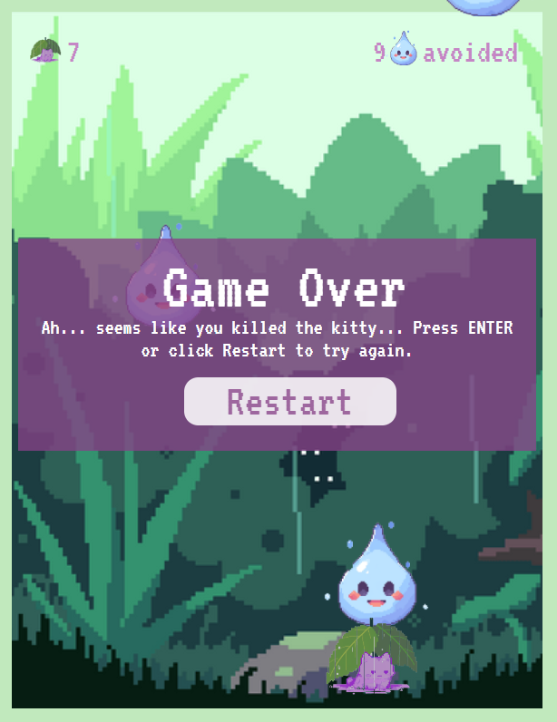
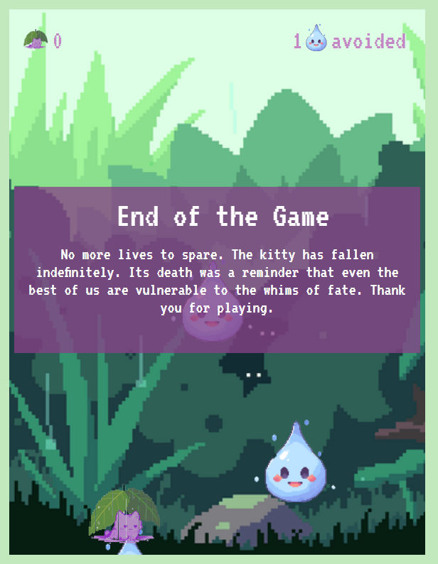

# A kitty's Tragedy

A dodging game about a cat trying to escape an acid rain. Once it is hit with a raindrop, it dies. Since cats have 9 lives, you can play up to 9 times before ending the game. There is no real way of winning (meaning you will always end up killing the poor kitty).

## Features include:

- A start message and button before the gameplay.
- A restart message and button when the game is over. The message changes depending on how many raindrops you avoid!
- An ending message once you have no more lives.
- A score system that shows how many raindrops you avoided.
- A lives system starting at 9.

### Screenshots of Start message, one of the Game Over message and the ending message

